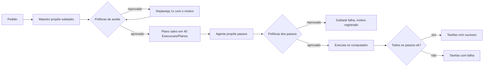

# Ciclo de validação de planos

Inspirado no fluxo do Maestro do hackathon: **quem propõe não aprova o próprio plano**.

## Estados de uma ação
| Estado | Significado |
|---|---|
| `proposto` | sugerido pelo Maestro/agente, ainda não validado |
| `aprovado` | passou nas políticas; pode executar |
| `executado` | todos os passos rodaram sem falha |
| `falhou` | algum passo falhou ou foi reprovado |
| `bloqueado` | política impediu (ex.: `cannot_do`) |

> [!warning] Validação é código
> As políticas que bloqueiam vivem em `ai-farm-agent/core/plan_validator.py`. As notas do cérebro orientam os agentes, mas **não concedem permissão** — editar uma nota não libera uma ação bloqueada.

Relacionado: [[Maestro]] · [[Politicas de aceite]]
