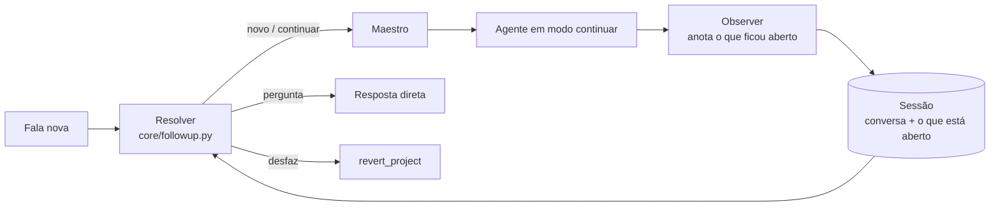

# 💬 Conversa contínua

← [[Maestro]] · [[Ciclo de validacao]] · [[Roteiro de testes]]

> [!lesson] Ideia
> Cada pedido pode continuar o anterior. O agente lembra **o que fez** e **o que ficou aberto**, e entende "agora", "esse", "o segundo", "aquela de baixo", "desfaz".

## Como funciona

| Alvo | O que fica guardado | Como o agente continua |
|---|---|---|
| **web** | janela, URL, itens visíveis numerados | piloto retoma **a mesma aba**; confere se ainda é a mesma página |
| **app:<nome>** | janela (handle), título, último texto | foca a mesma janela; **não digita** se a aba/documento ativo mudou |
| **code** | pasta e arquivos do projeto | edita só os arquivos necessários; versão anterior em `.ai_versions/`; "desfaz" volta |
| **folder** | última pasta usada | referência para o próximo pedido |

## Regras
- O estado guardado serve para **entender a referência**; antes de agir, o agente **olha a tela de novo**.
- Pedido vago que custa caro errar ("troque algumas coisas") → **uma** pergunta com opções; a resposta continua o mesmo pedido.
- Pergunta sobre algo já feito ("qual era o preço?") → resposta da conversa, sem executar nada.
- "Nova conversa" esquece tudo.

## Conversas salvas
Cada conversa fica em `memory/sessions/` com pedidos, respostas e o que ficou aberto. A barra lateral lista as conversas; clicar retoma o contexto (janelas que já foram fechadas são ignoradas).

## Avaliação
Cenários de conversa variados rodam sem executar nada: [[Avaliacao de conversas]] (`scripts/eval_conversations.py --vault`).

## Também em
- **Apps:** o piloto de apps continua na mesma janela (ex.: Calculadora).
- **Voz:** ver [[Modo voz]].

## Exemplos testados
- "abra o youtube e pesquise lofi para estudar" → "agora abra o segundo vídeo que está aparecendo"
- "abra o bloco de notas" → "agora escreva um texto curto sobre café"
- "crie um site em html, css e js sobre floricultura" → "troque a cor principal para azul" → "desfaz"
- "troque algumas coisas" → (pergunta) → "deixe os botões arredondados"
