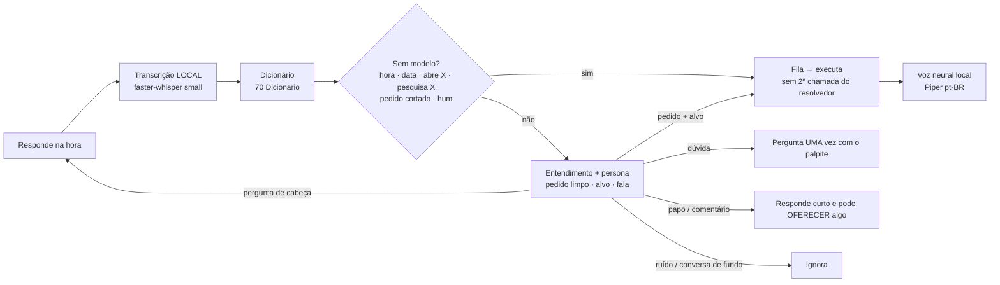

# 🎙️ Modo voz

← [[Maestro]] · [[Conversa continua]] · [[Dicionario de voz]] · [[Roteiro de testes]]

> [!lesson] Ideia
> Falar com o AI Farm Agent como numa conversa: ele entende **do jeito que a gente fala** (gírias, apelidos de apps, gaguejos), responde na hora, curto e natural, e vai executando enquanto você continua falando.

## Dois jeitos de falar
| Jeito | Como | Quando usar |
|---|---|---|
| **Mensagem de áudio** | clique no microfone (ao lado de Enviar) ou **Ctrl+Alt+V**, fale, clique em enviar | pedidos longos, ambiente com ruído, quando quer revisar |
| **Conversa ao vivo** | ligue **Conversa** e fale à vontade; cada pausa fecha um pedido | mãos livres: "abre o google" → "beleza, abrindo o Google" → "agora pesquisa…" |

Na conversa ao vivo os pedidos entram numa **fila** (um de cada vez, na ordem). Diga **"para"** para interromper e esvaziar a fila; **"para de ouvir"** desliga.

## Como entende

- **Nunca executa um palpite**: se não tiver certeza, pergunta "Foi pra abrir o VS Code?" — "sim" executa.
- **Pergunta só uma vez**: se continuar sem entender, fica quieto (a fala aparece na tela como "Ouvi: …").
- **Fala só o necessário**: confirma na hora ("Bora, abrindo o YouTube.") e no fim só fala se tiver algo a contar (um preço, uma manchete, um erro).
- Cita um app que **não** está aberto → é pedido novo (ex.: com o YouTube aberto, "configurações do Windows" abre as do Windows).
- **Responde na hora** o que não precisa do PC: hora e data (local, sem modelo), contas e conhecimento geral. Dado do momento (dólar, clima, notícia) sempre vai buscar.
- **Não age sem pedido**: comentário ("meu time ganhou") vira conversa; ele pode **oferecer** ("Quer que eu veja o placar?") e um "pode" executa a oferta.
- **Pedido demorado**: um aviso só ("Ainda tô nisso no navegador"). Na conversa ao vivo, o atalho **cala** a fala na hora.
- **Jeito de falar**: [[Persona do assistente]] (editável). Medição: [[Avaliacao de voz]].

## Configuração (`config.yaml` → `voice:`)
| Chave | Padrão | O que faz |
|---|---|---|
| `hotkey` | `ctrl+alt+v` | atalho global (se ocupado, tenta `ctrl+alt+m`, `ctrl+f9`) |
| `model` | `small` | transcrição (maior = mais preciso e mais lento; `large-v3-turbo` levou 16 s/frase neste PC) |
| `tts` / `tts_voice` | `piper` / `cadu` | voz local (`faber`, `jeff` também); `sapi` = voz do Windows |
| `tts_rate` | `1.05` | velocidade da fala |
| `live_pause_s` | `0.8` | pausa que fecha um pedido na conversa ao vivo |
| `progress_after_s` | `12` | segundos até o aviso de progresso falado (0 = nunca) |

## Ensinar o agente
Viu "Ouvi: …" errado? Acrescente a linha em [[Confusoes de transcricao]] (`fala errada | certo | motivo | auto ou dica` — `auto` só se a fala errada nunca for dita de propósito). Gíria nova? [[Girias e expressoes]]. Ele relê o dicionário a cada fala.
