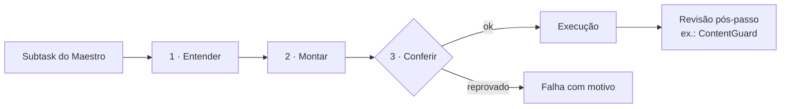

# Subagentes

← [[Maestro]] · [[Início]]

> [!maestro] 3 ajudantes por agente
> **Entender** o pedido → **Montar** o insumo da execução → **Conferir** antes de agir.
> 14 dos 15 são determinísticos (custo zero). Só o [[Builder]] do Code Agent usa o modelo.

![[Subagentes.base]]

