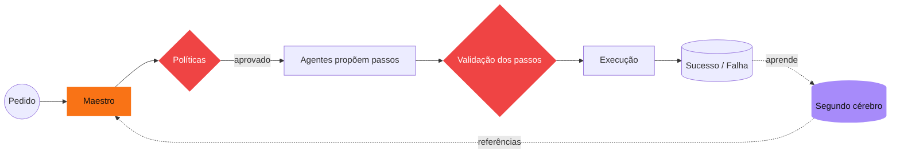

# AI Farm Agent

Segundo cérebro do time de agentes — **o Maestro orquestra, as políticas validam, a memória aprende.**

> [!grid]
> > [!maestro] [[Maestro]]
> > Entende o pedido, planeja, valida e registra.
>
> > [!web] [[Web Agent]]
> > Pesquisar, navegar e ler a web.
>
> > [!desktop] [[Desktop Agent]]
> > Operar aplicativos do Windows: Bloco de Notas, Word, Excel, Teams, WhatsApp, Outlook, Paint, Calculadora, Spotify.
>
> > [!code] [[Code Agent]]
> > Criar projetos de software completos (sites, scripts, APIs, apps desktop, jogos) e abrir no VS Code.
>
> > [!data] [[Data Agent]]
> > Criar planilhas Excel profissionais com openpyxl: dados, fórmulas, formatação e gráficos.
>
> > [!file] [[File Agent]]
> > Organizar, mover, copiar, encontrar e compactar arquivos com segurança.
>
> > [!memory] [[Memory Agent]]
> > Lembra rotas que funcionaram, nunca conteúdo.

## Operação
![[Execucoes.base#Recentes]]

## Conhecimento
> [!grid]
> > [!policy] [[Politicas de aceite]]
> > 11 regras que validam todo plano antes de executar.
>
> > [!route] [[Tarefas de referencia]]
> > 250+ caminhos prontos, 50 por agente, consultados em pedidos parecidos.
>
> > [!maestro] [[Subagentes]]
> > 3 ajudantes por agente: entender, montar, conferir.
>
> > [!skill] [[Skills|Skills do catálogo]]
> > 15 skills do AIWorkbench distribuídas por agente.
>
> > [!lesson] [[Licoes aprendidas]]
> > O que as falhas ensinaram e virou regra.
>
> > [!inbox] [[Inbox]]
> > Capture ideias e pedidos para virar playbook.
>
> > [!metric] [[Diario de operacoes]]
> > Uma nota por dia com todas as execuções.

## Falhas para revisar
![[Execucoes.base#Falhas]]

## Como o cérebro pensa

