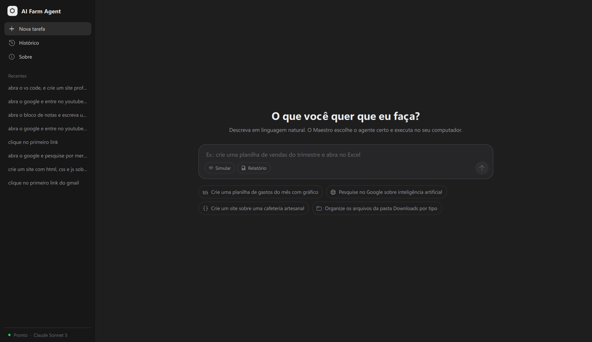
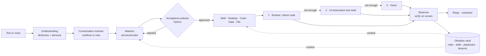
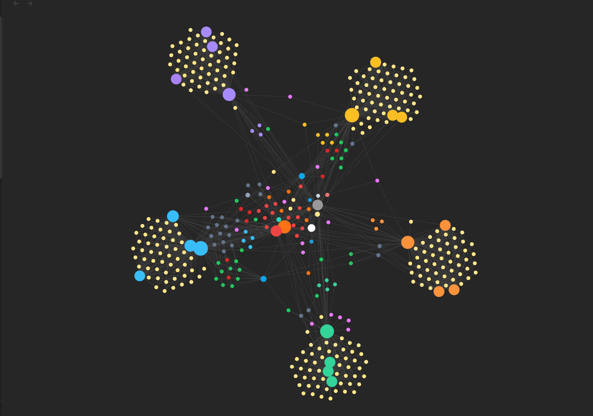
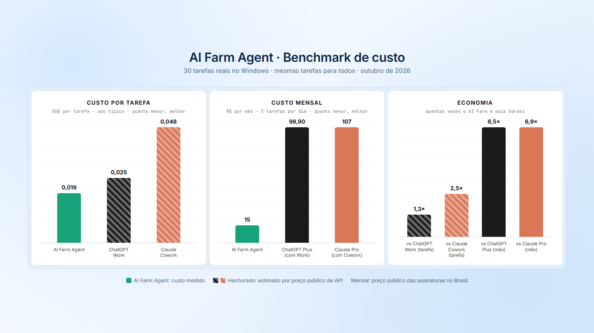

# AI Farm Agent

**A Windows multi-agent assistant that turns natural language — typed or spoken — into verified actions on your desktop.**

[](LICENSE)


[](https://github.com/ognistie/AI-Farm-Agent/actions/workflows/ci.yml)

[Highlights](#highlights) · [Architecture](#architecture) · [Second brain](#second-brain) · [Voice](#voice-and-conversation) · [Benchmark](#cost-benchmark) · [Getting started](#getting-started) · [Evaluation](#evaluation) · [Security](#security-and-privacy) · [Contributing](CONTRIBUTING.md)



## Overview

AI Farm Agent turns a request such as *"abre o Excel e preenche a primeira linha com Produto, Preço e Quantidade"* into a plan, validates it, executes it on the Windows desktop and checks the result on screen. A central orchestrator, **Maestro**, delegates to domain agents (Web, Desktop, Code, Data, File). Every agent reads an editable **Obsidian knowledge vault** before acting and writes the outcome back.

The design principle is **intelligence only where it is needed**:

1. Use a deterministic routine when one exists, with no model call.
2. Otherwise, read the screen as text through Windows UI Automation.
3. Fall back to vision only as a last resort.

Policies written in Python, not in prompts, decide whether a plan may run.

> **Status:** experimental and under active development. The interface and voice understanding are in Brazilian Portuguese. Run it in a dedicated environment; see [Security and privacy](#security-and-privacy).

## Highlights

| | |
| --- | --- |
| **Continuous conversation** | Follow-ups act on what is already open. *"Abre o YouTube"* → *"agora toca o segundo vídeo"* continues in the same tab; *"muda a cor do título"* edits the project just created, with a backup to undo. Conversations are saved and can be reopened. |
| **Local voice** | Speech recognition (faster-whisper) and the assistant's voice (Piper) run on the machine; audio never leaves it. Two modes: record-and-send, or live conversation that executes while you talk. |
| **Multi-agent orchestration** | Maestro plans and routes; each domain agent has three helper sub-agents (understand · build · review). |
| **Deterministic guardrails** | Acceptance policies (`POL-001`–`POL-007`) validate plans before dispatch. A rejected plan is replanned once with the literal reason. Sensitive actions (send, delete, pay, credentials) stay with the user. |
| **Second brain** | The Obsidian vault provides the agent's rules, known failures, playbooks, lessons learned, a ~2,600-variant Brazilian speech dictionary and the AIWorkbench engineering skills. Each request retrieves only what matches it. |
| **Measured cost** | Each model call is metered. In a 30-task benchmark the average cost was **US$ 0.019 per task**. |

## Architecture



### Request lifecycle

1. **Understand:** the dictionary fixes known transcription errors and slang. Simple requests ("open X", "search Y", time/date) are answered without a model call.
2. **Resolve:** with something open, the resolver decides whether the request continues in that window/tab or starts a new task.
3. **Plan:** Maestro decomposes the request with retrieved references and lessons, then `plan_validator.py` applies the acceptance policies.
4. **Execute:** agents emit steps. The automation engine runs routines directly. Open-ended goals go to the **browser pilot** or the **app pilot**, which read the window as numbered UI elements, choose one action per turn and re-read to confirm.
5. **Verify and record:** the observer checks the resulting window, tab or file. The reply is composed, and the plan, outcome and consulted notes are written to the vault.

### Repository layout

```text
AI-Farm-Agent/
├── ai-farm-agent/            Application
│   ├── agents/               Maestro, domain agents, sub-agents, validators
│   ├── core/                 LLM client, automation engine, pilots, brain, skills, session
│   │   └── voice/            Recorder, STT, TTS, understanding, persona, hotkey
│   ├── desktop/              PySide6/QML UI, controller, voice controller
│   ├── memory/               Route memory
│   ├── scripts/              Smoke tests, evaluations, benchmark
│   ├── state_maps/           Application navigation maps
│   └── main.py               Entry point
├── AI-Farm-agents/           Obsidian vault (second brain)
├── docs/                     Images and security review
└── config.yaml               Models, effort per agent, voice settings
```

## Second brain



The vault in `AI-Farm-agents/` is plain Markdown with frontmatter and wiki links. Obsidian is optional: the runtime reads the files directly through `core/brain.py`, and the application keeps working if the vault is missing.

For each request, `Brain.context_for(agent, task)` assembles a bounded block. It is budgeted per whole block, so nothing is cut mid-sentence. It contains:

- **Agent notes:** execution rules, how-to and known failures of the agent.
- **Skills:** the 1–3 most relevant [AIWorkbench](https://github.com/BielmFranco/AIWorkbench) skills for that agent and request, with only the lines written for that agent (`core/skills.py`).
- **Playbooks and reference tasks:** curated entries rank above automatically recorded executions.
- **Lessons learned:** every real failure that became a rule.
- **Dictionary terms:** Windows settings pages, keyboard shortcuts and app launch targets cited in the request.

The plan note records **"Consultou: …"** with every note and skill used. All of this is reference material: it never widens permissions, which live in Python.

| Vault directory | Purpose |
| --- | --- |
| `00 Maestro/` | Orchestration, conversation, voice, persona, evaluations, benchmark |
| `10 Agentes/` | Agent notes, playbooks and sub-agent descriptions |
| `20 Politicas/` | Human-readable acceptance policies |
| `30 Skills/` | AIWorkbench skills as usage manuals (when to activate, how each agent applies them, what to check) |
| `30 Tarefas de referencia/` | ~265 reference tasks with paths and acceptance criteria |
| `60 Aprendizados/` | Curated lessons learned |
| `70 Dicionario/` | Brazilian speech dictionary, Windows settings pages, keyboard shortcuts |
| `40 Execucoes/`, `50 Diario/` | Local execution records (generated notes are git-ignored) |

## Voice and conversation

- **Pipeline:**
  1. Microphone → local transcription (faster-whisper `small`, int8, CPU).
  2. Dictionary correction. Only `auto` confusions are rewritten; `dica` entries are hints for the model.
  3. One understanding call that returns the clean command, the continuation target and the immediate spoken reply.
- **Instant answers:** time, date and simple open/search requests have no model latency. A cut-off request ("abre o…") gets a clarifying question instead of a guess.
- **Persona:** one speaking style shared by voice, end-of-task replies and small talk. It is editable in `00 Maestro/Persona do assistente.md`, with ready-made lines that never repeat the last ones.
- **Live mode:** speech is queued while a task runs. Long tasks give one progress update. Background conversation is ignored.

## Cost benchmark



`scripts/bench_cost.py` ran 30 real tasks through the voice path, twice each: apps, browser, code, files, spreadsheets and questions. It recorded every model call (tokens, cache, cost) and every action. The run took place in October 2026.

| | AI Farm Agent (measured) | ChatGPT Work (estimated) | Claude Cowork (estimated) |
| --- | --- | --- | --- |
| Cost per task, typical scenario | **US$ 0.019** | US$ 0.025 | US$ 0.048 |
| Monthly, 5 tasks/day | **≈ R$ 15** | R$ 99.90 (ChatGPT Plus) | R$ 107 (Claude Pro) |

**Where the savings come from.** The same run would cost:
- 1.5× more without prompt caching;
- 1.3× more without deterministic routines;
- 1.9× more on a larger model;
- 3.5× more without all three.

**Method and limits:**
- **Competitors** were estimated as the API-equivalent cost of a screenshot agent using the same number of steps, at public prices. Their system prompt is assumed already cached.
- **In a lean competitor scenario the cost is roughly equal.** The monthly advantage shrinks above ~30 tasks/day.
- **Not compared:** quality and the real limits of the subscriptions.

The full report, with per-task numbers and assumptions, is in `AI-Farm-agents/00 Maestro/Benchmark de custo.md`.

## Getting started

### Requirements

- Windows 10 or 11 with an interactive desktop session.
- Python 3.11 or later.
- An Anthropic API key.
- Optional: microphone and speakers for voice mode. The speech models (~0.5 GB) are downloaded on first use.

### Installation

```powershell
git clone https://github.com/ognistie/AI-Farm-Agent.git
cd AI-Farm-Agent
python -m venv .venv
.\.venv\Scripts\python.exe -m pip install -r ai-farm-agent\requirements.txt
Copy-Item .env.example .env   # then set ANTHROPIC_API_KEY in .env
```

### Run

Start from the repository root so `config.yaml` is found:

```powershell
.\.venv\Scripts\python.exe ai-farm-agent\main.py
```

The voice hotkey defaults to `Ctrl+Alt+V`. Models, per-agent reasoning effort and voice settings are in `config.yaml`; `MODEL_FAST` / `MODEL_STRONG` override the model tiers.

### Example requests

```text
Abre o YouTube e procura lofi pra estudar        →  agora toca o segundo vídeo
Pesquisa o preço do fone JBL Tune 520 no Mercado Livre e me fala o mais barato
Cria um site para a padaria Pão Dourado          →  muda a cor do título para roxo
Abre as configurações do Windows                 →  clica em Sistema
Faz uma planilha de gastos mensais com 5 categorias e o total
Organiza a pasta Downloads por tipo
```

## Evaluation

| Script | What it checks | Model calls |
| --- | --- | --- |
| `scripts/smoke_code_agent.py` | Deterministic regression suite (430+ checks): routing, policies, voice understanding, vault retrieval, skills, security guards | None (mocked) |
| `scripts/eval_voice.py` | 50 hard utterances: misheard names, slang, self-correction, background talk | Yes (~US$ 0.17) |
| `scripts/eval_conversations.py` | 28 multi-turn scenarios through resolver → Maestro → agent plans, without executing | Yes (~US$ 0.15) |
| `scripts/eval_skills.py` | A/B of the Code agent with and without skills | Yes (~US$ 0.70) |
| `scripts/bench_cost.py` | Cost benchmark; **executes real tasks on the desktop** | Yes (~US$ 1.20) |

```powershell
cd ai-farm-agent
..\.venv\Scripts\python.exe -X utf8 scripts\smoke_code_agent.py
```

Model-backed scripts write their reports to the vault (`--vault`). Review them before running: they spend API credits, and `bench_cost.py` opens and operates applications.

## Security and privacy

The application runs with the permissions of the current Windows user. Generated Python runs in-process, and browser automation can use your signed-in sessions. **Use a dedicated environment with non-sensitive files and accounts.**

Implemented controls:
- acceptance policies before execution;
- `open_path` refuses executables, disk images and network/UNC paths;
- the Start-menu fallback refuses names containing commands or paths;
- page and window text in model context is treated as data, never as instructions;
- writing goes only to a blank document, never to an open user file;
- login, CAPTCHA, payments and sends are handed back to the user.

There is **no isolated sandbox** and no universal action-level authorization gate yet. Read [SECURITY.md](SECURITY.md) and the [security review](docs/security-review.md) before using it with real data.

## Roadmap

- Isolated execution and action-level authorization.
- Spoken confirmation for irreversible actions.
- A thinner fixed layer per request, with direct routing for simple tasks.
- Packaged installer.
- Reproducible end-to-end evaluation on a clean VM.

These are development directions, not commitments.

## Contributing

Issues and pull requests are welcome. See [CONTRIBUTING.md](CONTRIBUTING.md), the [Code of Conduct](CODE_OF_CONDUCT.md) and the [CHANGELOG](CHANGELOG.md).

## License

[MIT](LICENSE). Bundled third-party assets keep their own licenses, including the Obsidian Minimal theme.
