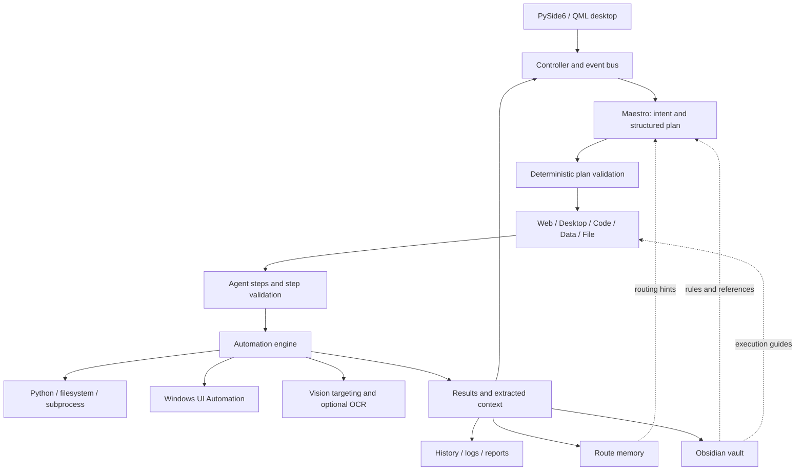

# AI Farm Agent

A Windows desktop agent system for natural-language task execution, combining LLM planning, deterministic validation, native UI automation and an editable knowledge base.

[Architecture](#architecture) · [Second brain](#second-brain) · [Getting started](#getting-started) · [Evaluation](#evaluation) · [Security](SECURITY.md) · [Contributing](CONTRIBUTING.md) · [MIT license](LICENSE)


## Overview

AI Farm Agent translates a user goal into a sequence of actions on a Windows workstation. A central orchestrator, **Maestro**, decomposes requests and delegates them to domain agents. The application executes their validated plans, passes results between dependent subtasks and records outcomes for later inspection.

The project explores **agentic desktop automation**, **hierarchical orchestration**, **structured planning**, **retrieval-augmented context** and **human-supervised execution**. It is an experimental implementation under active development. There is no published benchmark establishing general task success, latency or cost.

Typical tasks include creating spreadsheets, generating software projects, navigating websites, interacting with desktop applications and organizing files. The interface is in Brazilian Portuguese; example requests below reflect that language.

## Capabilities

| Agent | Responsibility | Implementation approach |
| --- | --- | --- |
| Maestro | Intent analysis, ambiguity detection, decomposition and routing | LLM-generated JSON plans, reference retrieval and deterministic acceptance policies |
| Web | Search, navigation and page reading | Fixed routines for simple requests; an observation–action loop for complex browser goals |
| Desktop | Application launch, text entry and window interaction | Application routines, Windows UI Automation and screenshot-based targeting |
| Code | Generate scripts, websites and multi-file projects | Task classification, optional architecture planning, code generation and static validation |
| Data | Generate Excel workbooks, formulas and charts | Python generation with workbook-oriented validation |
| File | Locate, organize and manipulate files | Path resolution, operation classification and destructive-operation checks |
| Memory | Suggest previously useful execution routes | Local JSON route store with similarity matching and outcome counters |

Supporting modules provide screenshot capture, OCR, retries, conditional waits, context propagation, action logging and report generation. Domain agents use named helpers for interpretation, preparation and review; these helpers are primarily deterministic components, with model calls in selected planning and generation paths.

## Architecture

The application uses a **controller-driven, sequential orchestration pipeline**. Agents propose actions; Python validators assess plans before the execution engine dispatches them. Dependencies carry extracted outputs, file paths and URLs into subsequent subtasks.



### Planning and execution

1. The desktop bridge submits a task to the controller, which starts a background worker and publishes progress events.
2. Maestro detects common ambiguities, retrieves similar routes and reference tasks, and requests a structured plan from the model.
3. `plan_validator.py` checks agent identifiers, required content, search terms and context dependencies. A rejected Maestro plan receives one replan attempt with explicit feedback.
4. Each domain agent produces action steps. Additional validators inspect content, code syntax, project structure or operation safety, depending on the agent.
5. The automation engine dispatches accepted actions. Selected visual failures receive retries; browser tasks run their own bounded loop.
6. The controller records step outcomes, extracts artifacts, updates route statistics and writes execution notes.

The distinction between **planning**, **validation** and **execution** makes failures inspectable. Validation coverage is finite: an accepted plan is not a proof of safety or complete task fulfillment.

### Interaction backends

Direct Python and filesystem operations handle tasks that can be expressed programmatically, such as generating workbooks or writing project files. Windows UI Automation exposes semantic controls for application interaction. Screenshot-based vision provides an alternative when accessible controls are insufficient; optional local OCR supports text discovery.

For complex browser tasks, `BrowserPilot` repeatedly reads an accessibility snapshot, presents numbered elements and visible context to the model, executes one selected action and observes the new state. The loop supports navigation, clicking, typing and scrolling, with a configurable constructor turn limit. Simple open/search requests retain fixed routines. Playwright is an optional backend for supported web actions.

### Model access and observability

`AIClient` centralizes Anthropic API access, streaming, system-prompt caching, text-block extraction and usage accounting. Model tiers and per-agent reasoning effort are configured in `config.yaml`; `MODEL_FAST` and `MODEL_STRONG` can override tier identifiers through the environment.

Token usage comes from API responses. Dollar costs are **estimates calculated from the pricing table in the source**, rather than billing records. Model availability, supported parameters and pricing must be checked against the provider before use.

## Second brain


The second brain is an **Obsidian-compatible Markdown vault**, stored in `AI-Farm-agents/`. Notes use YAML frontmatter, sections and wiki links to connect the orchestrator, domain agents, policies, playbooks and reference tasks. Obsidian visualizes those links as a graph; the runtime reads the files directly and does not require Obsidian to be running.

`core/brain.py` implements the integration:

- **Agent guidance:** extracts the `Regras de execução` section from an agent note and adds a bounded excerpt to the planning context.
- **Reference retrieval:** tokenizes the request, normalizes accents, scores word-set overlap and selects relevant paths from curated tasks, playbooks and successful execution notes. This is lexical retrieval, without embeddings or a vector database.
- **Execution provenance:** writes proposed plans, validation outcomes, helper traces and execution results to Markdown notes, with a daily operations index.
- **Graceful degradation:** the application continues when the vault is absent or disabled.

The runtime applies pattern-based redaction to selected note content, but this is not comprehensive anonymization. Generated notes and daily journals are local operational data and are excluded from version control.

| Vault directory | Purpose |
| --- | --- |
| `00 Maestro/` | Orchestration, routing and validation guidance |
| `10 Agentes/` | Agent notes, playbooks and helper descriptions |
| `20 Politicas/` | Human-readable counterparts of acceptance policies |
| `30 Skills/` | Curated skill references |
| `30 Tarefas de referencia/` | Task examples with paths and acceptance criteria |
| `40 Execucoes/` | Local proposed plans and success/failure records, alongside public index notes |
| `50 Diario/` | Local daily execution journals and a public index |
| `60 Aprendizados/` | Curated lessons |
| `90 Sistema/` | Templates and Obsidian Bases definitions |

To extend the knowledge base, add a reference note with `keywords` in its frontmatter and a `Caminho` section. Related requests can then retrieve it as a planning hint. Runtime blocking policies remain in Python; editing a note does not establish an execution permission boundary.

### Route memory

Route memory is separate from the vault. Version 6 stores the agent sequence, routing fields, parameter names and dependency structure, together with task descriptions and success/failure counters. It omits task-specific parameter values from the stored route and always supplies hints for a fresh plan. Routes with more failures than successes are not suggested.

This is retrieval and outcome tracking, not model training or automatic policy rewriting. Route files can still contain sensitive task descriptions and must remain local.

## Getting started

### Requirements

- Windows 10 or 11 with an interactive desktop session.
- Python 3.11 or later as the project target; dependency compatibility depends on the installed Python version.
- An Anthropic API key and access to the model identifiers selected in the configuration.
- Target applications installed when a task requires them. Excel is needed to open workbooks in Excel; workbook generation uses Python libraries.

### Installation

Run from PowerShell:

```powershell
git clone https://github.com/ognistie/AI-Farm-Agent.git
cd AI-Farm-Agent
python -m venv .venv
.\.venv\Scripts\python.exe -m pip install -r .i-farm-agent
equirements.txt
Copy-Item .env.example .env
```

Edit `.env` and set `ANTHROPIC_API_KEY` to your own key. Select provider-supported model identifiers in `config.yaml` or through `MODEL_FAST` / `MODEL_STRONG`. Configuration precedence is environment overrides, then YAML, then source defaults.

Start **from the repository root** so the root `config.yaml` is discovered:

```powershell
.\.venv\Scripts\python.exe .i-farm-agent\main.py
```

The entry point launches a native Qt application. No Flask server or browser UI is required. Optional dependencies such as Playwright and EasyOCR are documented in `requirements.txt`; libraries imported by generated Python may also be installed automatically by the execution engine.

### Example requests

```text
Crie uma planilha de gastos do mês com gráfico.
Crie um site sobre uma cafeteria artesanal.
Pesquise sobre um tema e anote um resumo no bloco de notas.
Organize os arquivos da pasta Downloads por tipo.
```

Use **Simular** to inspect supported planned actions before execution. Simulation can still invoke the model and write local records; some generic filesystem handlers do not enforce the simulation flag, so it is not an isolation guarantee. **Esc** requests cancellation; it is cooperative and does not forcibly terminate code already running inside the process.

## Repository layout

```text
AI-Farm-Agent/
├── ai-farm-agent/
│   ├── agents/             Domain agents, planners and validators
│   ├── core/               LLM client, automation, browser pilot and vault integration
│   ├── desktop/            Qt bridge, controller, QML views and local history
│   ├── memory/             Route storage
│   ├── scripts/            Smoke tests and evaluation utilities
│   ├── state_maps/         Application navigation maps
│   ├── main.py             Desktop entry point
│   └── requirements.txt
├── AI-Farm-agents/          Curated Obsidian knowledge vault
├── docs/                   Images and security review
├── config.yaml
├── CONTRIBUTING.md
├── SECURITY.md
└── LICENSE
```

## Evaluation

Run the deterministic smoke suite from the application directory:

```powershell
cd ai-farm-agent
..\.venv\Scripts\python.exe -X utf8 scripts\smoke_code_agent.py
```

The suite exercises routing heuristics, validation, route memory, parsing, context handling and browser-pilot behavior with mocked components. It makes no live API calls and does not establish end-to-end reliability on arbitrary Windows applications.

Additional scripts (`run_evolution_suite.py`, `run_diverse_suite.py`, `run_creative_suite.py`) perform model-backed generation experiments. Review them before running: they use the configured API and may create local artifacts. The vault also contains a manual regression checklist at `00 Maestro/Roteiro de testes.md`.

For reproducible experiments, record the commit, Windows/application versions, model identifiers, configuration, task dataset, artifact checks and API usage. No aggregate benchmark results are claimed here.

## Security and privacy

The application runs with the permissions of the current Windows user. Generated Python executes in-process, shell actions can launch commands, and browser automation can interact with an authenticated session. **Use a dedicated test environment with non-sensitive files and accounts.**

Prompts, retrieved content and screenshots can be sent to the configured model provider. Local histories, logs, reports and notes can retain request text or other personal data. Git exclusions limit accidental publication; they do not encrypt records or remove previously committed content from Git history.

The current implementation includes validation and selected blocking checks, but lacks an isolated execution sandbox and a universal authorization gate at dispatch time. Read [SECURITY.md](SECURITY.md) and the [repository security review](docs/security-review.md) before running tasks with sensitive data.

## Development directions

Current engineering priorities are isolated execution, action-level authorization, stronger secret redaction, reproducible end-to-end evaluations and dependency integrity. These are development directions, not implemented guarantees or delivery commitments.

Contributions to documentation, regression cases, reproducibility and execution safety are welcome. See [CONTRIBUTING.md](CONTRIBUTING.md) for the workflow and [CHANGELOG.md](CHANGELOG.md) for implementation history.

## License

Project code and documentation are licensed under the [MIT License](LICENSE). Bundled third-party assets retain their original notices and license terms, including the Obsidian Minimal theme.
